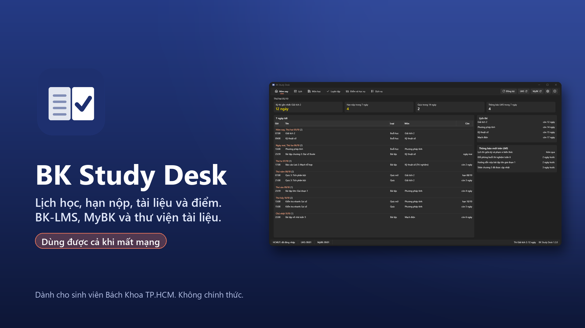

# BK Study Desk

[](README.md) [](README.en.md)

> Translated from README.md (Vietnamese) for BK Study Desk 1.1.3.



A small Windows app for students of **Ho Chi Minh City University of Technology (HCMUT)**. It brings **BK-LMS** and **MyBK** together in one window:
- deadlines and quizzes;
- timetable and exam schedule;
- course documents, downloaded section by section when you choose;
- grades (LMS gradebook and MyBK component scores);
- curriculum progress;
- **practice**: write your own quizzes, review LMS quizzes you have submitted, take mock exams;
- shortcuts to about 30 university services.

> **Unofficial.** This is a personal project, not affiliated with or endorsed by HCMUT or Moodle HQ. The app uses your own account and only reads what you can already see after signing in. Every address and API the app calls is listed on the Wiki page [How the app works](../../wiki/Cách-app-hoạt-động) (Vietnamese). If the university asks, the project will change or remove the feature concerned.

The interface is Vietnamese by default; English is available in **Settings**. The Wiki is written in Vietnamese.

## Install

**Option 1: installer from GitHub (recommended).** New versions appear here as soon as they are released, and the app tells you when the next one is out.

1. Download `BKStudyDesk-x.y.z-Setup-x64.exe` from [Releases](../../releases/latest) (ARM laptops: `-Setup-arm64.exe`).
2. Run it, choose an install folder and click **Install**. No admin rights needed. The installer is not code-signed yet, so Windows SmartScreen shows a warning once: click **More info** > **Run anyway**.
3. On first launch, choose how updates are handled and where documents are saved, then **Sign in to HCMUT**.

**Option 2: Microsoft Store.** [BK Study Desk on the Microsoft Store](https://apps.microsoft.com/detail/9NX0KRZRR850): no SmartScreen warning. Every new version waits for Microsoft review (sometimes a few days), so the Store version is usually behind GitHub. Compare the version number with [Releases](../../releases/latest) before installing.

The two are built from the same source but are separate installs with separate data. Install only one.

### After installing

Open the app, choose **Sign in to HCMUT** and sign in on the university SSO page. One sign-in covers both LMS and MyBK.

**Requirements:**
- Windows 10 1809 or later, or Windows 11 (x64 or ARM64).
- Microsoft Edge WebView2 Runtime (included in Windows 11).
- No .NET installation needed.

## Features

- **Today**:
  - countdown to the next exam;
  - deadlines in the next 7 days and quizzes;
  - new LMS announcements.
- **Calendar**:
  - upcoming items by day, exam schedule;
  - timetable as a **week grid** (like Google Calendar) or a list;
  - **Export calendar (.ics)…**: save the whole-term timetable and exams to a file you can import into Google Calendar, Outlook or Windows Calendar.
- **Subjects**:
  - browse each subject's folder like File Explorer;
  - see new files, deadlines, announcements, gradebook and classes on LMS;
  - **download documents section by section**, filter by file type (PDF, slides, other), optionally extract .zip/.rar/.7z;
  - optional auto-download: each sync fetches new files (including assignment attachments), so they open even when LMS is slow.
- **Grades & records**:
  - transcript by term with component scores;
  - curriculum progress by knowledge block;
  - LMS gradebook, course registration results (with lecturer and class times), community service days, academic decisions.
- **Practice**: quizzes for revision only; nothing affects your LMS grades.
  - **Write quizzes** per subject, chapter and lesson, with the 5 LMS question types (single choice, multiple choice, true/false, numeric, short answer), images and formulas.
  - **Ask AI**: the app writes the prompt; paste the AI's answer back into the app.
  - **Import and export** quizzes as Markdown (`.md`, or `.zip` with images), Moodle XML, GIFT, Aiken. Format: [`studypack/`](studypack/).
  - **Keep submitted LMS quizzes** for later review, even when LMS is slow (can be turned off). The app only reads the review page after you submit and never touches a quiz in progress. Closed quizzes can be shared.
  - **Review**: "Review today" brings back questions you often miss and spaces them out once you know them; random mock exams, flag questions, private notes.
- **Services**: open MyBK, LMS, BKPay, course registration… inside the app with the same sign-in.
- **Single sign-on**: sign in once to HCMUT SSO for both LMS and MyBK; while the session is valid the app signs back in by itself.
- **Behaves like a Windows app**:
  - Windows 11 (Fluent) theme that follows light/dark mode and your accent color;
  - sortable tables, right-click menus;
  - shortcuts Ctrl+1…7, F5, Alt+←;
  - system tray icon and deadline reminders;
  - start with Windows;
  - the close button minimizes to the tray or exits, your choice.
- **Choose the documents folder** in Settings.
- **Languages**: Vietnamese (source) and English. To add one, drop a JSON file into `lang\`; see [`src/SoHocTap/lang/README.md`](src/SoHocTap/lang/README.md).

## Security and privacy

Full policy: [PRIVACY.en.md](PRIVACY.en.md).

- Your password is typed only on the university SSO page. The app never reads it. If you choose **Save** when the sign-in window asks, the in-app browser (WebView2) stores the password encrypted on your PC, like Edge, to fill it in next time; otherwise nothing is saved.
- Everything lives in the data folder `%LOCALAPPDATA%\BKStudyDesk.Data\data`, not in the install folder:
  - cookies in `data\webview`, encrypted by WebView2;
  - the LMS token in `data\secrets\`, **encrypted with Windows DPAPI**, so it does not work on another PC or Windows account.
- The data folder sits in `%LOCALAPPDATA%`, readable only by your Windows account (plus SYSTEM and Administrators).
- **Stay signed in after closing the app** keeps cookies for at most 8 hours, the SSO server's session limit; it can be turned off in Settings.
- The LMS token comes from Moodle's built-in sign-in flow for the mobile app (`launch.php`, service `moodle_mobile_app`, URL scheme `moodlemobile` of the official Moodle app). Details on the Wiki page [How the app works](../../wiki/Cách-app-hoạt-động).
- Limit: malware running under your own Windows account can still read the session. This is true of any Windows app. If you suspect malware, choose **Sign out** and change your HCMUT password.
- The app only calls **read** APIs and sends data nowhere except the university servers (GitHub is asked for new versions only if you allow it). It never submits work, registers, cancels, pays or takes quizzes for you.
- The app does not store your ID card number, address, phone number, date of birth or personal email, even when MyBK returns them.
- It calls the university servers as little as possible:
  - nothing before you sign in;
  - LMS every 3 hours, only this term's classes and only what changed (usually 15–30 requests);
  - MyBK every 12 hours;
  - 300 ms between requests; when a server says it is busy, the app waits per `Retry-After`;
  - after an error it waits for the next cycle before retrying by itself (you can still choose **Retry**).

## Build from source

```powershell
cd src/ui; npm ci; npm run build; cd ../..     # Practice view (Svelte), builds into ui/
dotnet build src/SoHocTap -c Release
dotnet publish src/SoHocTap -c Release -r win-x64 --self-contained -o publish
```

Needs the .NET 10 SDK, Node 24 and Windows. Code layout:

| Folder | Contents |
|---|---|
| `src/SoHocTap/Core` | paths, config (`Core/DefaultConfig.json`), JSON storage, log, credential encryption, .ics export |
| `src/SoHocTap/Sources` | LMS connector (Moodle mobile web service), MyBK, sync scheduler |
| `src/SoHocTap/Files` | subject folders, duplicate detection, archive extraction |
| `src/SoHocTap/Shell` | sign-in, hidden WebView for MyBK, tray, notifications, autostart |
| `src/SoHocTap/Ui` | WPF UI (`MainWindow`, `Pages/`), language packs |
| `src/SoHocTap/lang` | language packs (`vi.json`, `en.json`) |
| `src/SoHocTap/Updates` | update check and install (Velopack), per the user's choice |
| `src/BKStudyDesk.Setup` | Vietnamese installer and uninstaller (.NET Framework 4.8) |
| `src/ui` | Practice view (Svelte) |
| `tests/SoHocTap.Tests` | unit tests |

University URLs, API paths, folder names and sync intervals live in config (`Core/DefaultConfig.json`), not scattered in code. `data\config.json` stores only what you changed from the defaults.

## Contributing

See [CONTRIBUTING.en.md](CONTRIBUTING.en.md) and the [code of conduct](CODE_OF_CONDUCT.en.md). Keep the **read-only** rule: no feature may submit work or change data on university systems.

## Contact

- Bugs and ideas: [GitHub Issues](https://github.com/xeroz369/bk-study-desk/issues). Issues are public; do not paste student IDs, grades or tokens.
- Security vulnerabilities: report privately per [SECURITY.en.md](SECURITY.en.md).
- Official project contact (privacy, licensing, private matters): [bkstudydesk@xerozsoft.com](mailto:bkstudydesk@xerozsoft.com).

## License

[PolyForm Noncommercial 1.0.0](LICENSE.md) (since 1.0.6; earlier versions were MIT). The source is public, **not for commercial use**:
- **Allowed:** use, modify and share for personal use, study, research, schools and nonprofits. Keep the author line (Required Notice) in LICENSE.
- **Not allowed:** selling the app or a modified version, or including it in a paid product or service.
- **Support** for the author is voluntary; it is not a purchase.

By contributing code (a pull request) you agree to license your contribution under the same terms.

Third-party libraries keep their own licenses: NuGet packages in the `.csproj` files, npm packages in `src/ui/package.json` (mostly MIT), MathJax bundled in `src/ui/public/vendor/mathjax` (Apache-2.0, LICENSE included).

## Support

The app is free and will keep getting fixes and new features. If it helps you, you can buy the author a coffee. Support is voluntary and unlocks nothing extra in the app.

- **Ko-fi:** [ko-fi.com/F1F3SN4UE](https://ko-fi.com/F1F3SN4UE) (international cards, PayPal).
- **MoMo / Vietnamese banks (VietQR):** scan the code below with MoMo or a banking app.


