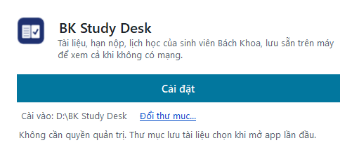

# BK Study Desk

[](README.md) [](docs/en/README.md)


App Windows cho sinh viên Bách Khoa TP.HCM: kết hợp BK-LMS và MyBK và vài tính năng khác. Bản cho macOS và Linux đang thử nghiệm, chưa ổn định (xem [mục bên dưới](#bản-cho-macos-và-linux-thử-nghiệm)).
- Deadline, quiz, thời khóa biểu, lịch thi, điểm.
- Tài liệu từng môn, chọn mục nào tải mục đó.
- Luyện tập: tự soạn quiz, ôn quiz LMS, thi thử.
- Thư viện tài liệu chung theo môn ([hcmut-library](https://bk-study-library.github.io/hcmut-library/)).
- Xem được khi mất mạng: lịch, điểm, tài liệu đã tải, luyện tập theo lần đồng bộ gần nhất.

> **Không chính thức.** Dự án cá nhân, không do trường hay Moodle HQ xác nhận. App chỉ đọc những gì tài khoản của bạn vốn xem được. Địa chỉ và API app gọi: Wiki [Cách app hoạt động](../../wiki/Cách-app-hoạt-động).

Giao diện mặc định tiếng Việt, có thêm tiếng Anh.

**Hướng dẫn chi tiết:** [Wiki](../../wiki) (cài đặt, cập nhật, gỡ app, luyện tập, câu hỏi thường gặp).

## Cài đặt

**Cách 1: bộ cài trên GitHub (khuyên dùng).** Bản mới có ở đây ngay khi phát hành, và app tự báo khi có bản sau.

1. Tải `BKStudyDesk-x.y.z-Setup-x64.exe` ở [Releases](../../releases/latest) (máy chip ARM: bản `-Setup-arm64.exe`).
2. Mở file, chọn thư mục cài, chọn **Cài đặt**. Không cần quyền admin. Bộ cài chưa có chữ ký số nên Windows hiện cảnh báo SmartScreen: chọn **Thông tin thêm** > **Vẫn chạy** (chỉ một lần).
3. Lần mở đầu, chọn cách cập nhật và thư mục lưu tài liệu, rồi **Đăng nhập HCMUT**.

**Cách 2: Microsoft Store.** [BK Study Desk trên Microsoft Store](https://apps.microsoft.com/detail/9NX0KRZRR850): không có cảnh báo SmartScreen. Mỗi bản mới phải chờ Microsoft duyệt (có khi vài ngày), nên bản Store thường chậm hơn bản trên GitHub. So số phiên bản ở trang Store với [Releases](../../releases/latest) trước khi cài.

Hai cách cài dùng chung mã nguồn nhưng là hai bản riêng, dữ liệu không dùng chung. Chỉ nên cài một trong hai.



Hướng dẫn chi tiết trên **[Wiki](../../wiki)**: [Cài đặt](../../wiki/Cài-đặt) | [Cập nhật](../../wiki/Cập-nhật) | [Gỡ cài đặt](../../wiki/Gỡ-cài-đặt) | [Luyện tập](../../wiki/Luyện-tập) | [Câu hỏi thường gặp](../../wiki/Câu-hỏi-thường-gặp).

### Sau khi cài

Mở app, chọn **Đăng nhập HCMUT**, rồi đăng nhập trên trang SSO của trường. Một lần đăng nhập dùng được cho cả LMS và MyBK.

**Yêu cầu:**
- Windows 10 1809 trở lên, hoặc Windows 11 (x64 hoặc ARM64).
- Microsoft Edge WebView2 Runtime (Windows 11 có sẵn).
- Không cần cài .NET.

## Bản cho macOS và Linux (thử nghiệm)

**Chưa ổn định.** Bản macOS và Linux là cùng một app với bản Windows (thư mục `src/BKStudyDesk.Desktop`, viết bằng Avalonia). Từ 1.2.2 có bộ cài ở [Releases](../../releases/latest), nhưng chưa được thử trên máy Mac hay máy Linux thật.

Cài:
- Linux (x64): tải `BKStudyDesk-x.y.z-linux-x64.AppImage`, chạy `chmod +x` cho tệp rồi mở. Cần gói `libwebkit2gtk-4.1-0`.
- macOS: tải `BKStudyDesk-x.y.z-Setup-osx-arm64.pkg` (chip Apple) hoặc `-osx-x64.pkg` (chip Intel). Bộ cài chưa ký số nên macOS chặn lần đầu: vào **Cài đặt hệ thống** > **Quyền riêng tư và bảo mật**, chọn **Vẫn mở**.

Mỗi lần đổi mã, CI build app, chạy test lõi, test bộ vẽ công thức và mở app chụp trang Hôm nay, Lịch, Luyện tập trên Windows, macOS, Linux (kết quả ở tab Actions). Chưa kiểm trên máy thật:
- đăng nhập SSO trong trình duyệt nhúng (WKWebView trên macOS, WebKitGTK trên Linux), MyBK chạy ẩn;
- thông báo, biểu tượng ở khay, tự chạy cùng máy, tự cập nhật.

Khác với bản Windows:
- token LMS lưu thành tệp chỉ tài khoản của bạn đọc được (quyền 600), chưa mã hóa như DPAPI trên Windows;
- **Tự đăng nhập lại khi hết phiên** dùng `secret-tool` (libsecret) trên Linux nếu máy có; macOS chưa hỗ trợ.
- Lỗi đã biết trên macOS: vài chữ có dấu hiện sai (ví dụ "để" thành "đế", "chỗ" thành "chô", "Ôn" thành "On"), thấy trên ảnh chụp của CI.

Hoặc chạy từ mã nguồn (cần .NET 10 SDK; Linux cần thêm gói `libwebkit2gtk-4.1-0` và `libicu`, thường có sẵn):

```bash
dotnet run --project src/BKStudyDesk.Desktop -c Release -f net10.0
```

Gặp lỗi thì báo ở [Issues](https://github.com/xeroz369/bk-study-desk/issues), ghi hệ điều hành và phiên bản; tệp `app.log` trong thư mục `data` của app giúp tìm lỗi nhanh (đọc qua trước khi gửi, đừng dán MSSV hay token).

## Tính năng

- **Hôm nay**:
  - đếm ngược tới kỳ thi gần nhất;
  - deadline trong 7 ngày và quiz;
  - thông báo mới trên LMS.
- **Lịch**:
  - việc sắp tới theo ngày, lịch thi;
  - thời khóa biểu dạng **lưới tuần** (giống Google Calendar) hoặc danh sách;
  - **Xuất lịch (.ics)**: lưu thời khóa biểu cả kỳ và lịch thi ra file để nhập vào Google Calendar, Outlook, Lịch của Windows.
- **Môn học**:
  - duyệt thư mục từng môn kiểu File Explorer;
  - xem file mới cập nhật trên máy, deadline, thông báo, sổ điểm và các lớp trên LMS.
  - **Tải tài liệu theo từng mục** của lớp trên LMS, chọn loại file (PDF, slide, khác), tùy chọn tự giải nén .zip/.rar/.7z.
  - Bật tự tải: mỗi lần đồng bộ, app tải file mới (cả đề và file đính kèm bài tập), LMS chậm vẫn mở được.
- **Điểm và học vụ**:
  - bảng điểm theo học kỳ kèm điểm thành phần;
  - tiến độ CTĐT theo khối kiến thức;
  - sổ điểm LMS, kết quả đăng ký môn (kèm giảng viên và giờ học), ngày CTXH, quyết định học vụ.
- **Luyện tập**: tự làm quiz để ôn bài, không ảnh hưởng gì tới điểm trên LMS. **Hướng dẫn từng bước có ảnh: [Wiki** > **Luyện tập](../../wiki/Luyện-tập).**
  - **Tự soạn quiz** cho từng môn, chương, bài. Có đủ 5 dạng câu như quiz LMS (chọn một, chọn nhiều, đúng/sai, điền số, điền chữ), chèn được ảnh và công thức.
  - **Nhờ AI soạn**: app viết sẵn câu lệnh cho AI, bạn chỉ cần dán câu trả lời của AI vào app.
  - **Nhập và xuất** quiz dạng Markdown (`.md` hoặc `.zip` nếu có ảnh), Moodle XML, GIFT, Aiken. Định dạng file xem ở [`studypack/`](studypack/).
  - **Lưu lại quiz LMS đã nộp** để xem lại sau, kể cả lúc LMS chậm (tắt được trong Cài đặt). App chỉ đọc trang xem lại sau khi bạn nộp, không đụng tới quiz đang làm. Quiz đã đóng thì chia sẻ được.
  - **Ôn tập**: mục "Ôn hôm nay" nhắc lại những câu bạn hay sai, nhớ rồi thì giãn lịch ra; có đề thi thử ngẫu nhiên, đánh dấu câu nghi sai và ghi chú riêng.
- **Dịch vụ**: mở MyBK, LMS, BKPay, đăng ký môn... ngay trong app, dùng chung một lần đăng nhập.
- **Đăng nhập một lần**: SSO HCMUT một lần là vào được cả LMS và MyBK. Phiên đăng nhập còn hạn thì app tự đăng nhập lại.
- **Dùng như app Windows thật**:
  - theme Windows 11 (Fluent), tự theo sáng/tối và màu nhấn;
  - bảng sắp xếp được, menu chuột phải;
  - phím tắt Ctrl+1...7, F5, Alt+←;
  - biểu tượng ở khay hệ thống, nhắc deadline;
  - tự chạy cùng Windows;
  - chọn X thì thu xuống khay hệ thống hoặc thoát hẳn, tùy bạn chọn.
- **Chọn thư mục lưu tài liệu** trong Cài đặt.
- **Ngôn ngữ**: tiếng Việt (gốc) và tiếng Anh. Muốn thêm ngôn ngữ thì thả một file JSON vào `lang\`, xem [`src/BKStudyDesk.Core/lang/README.md`](src/BKStudyDesk.Core/lang/README.md).

## Bảo mật và quyền riêng tư

Chính sách đầy đủ: [PRIVACY.md](PRIVACY.md).

- Mật khẩu chỉ gõ trên trang SSO của trường. App không đọc mật khẩu. Nếu bạn chọn **Lưu** khi trang đăng nhập hỏi, trình duyệt trong app (WebView2) sẽ lưu mật khẩu (mã hóa trên máy, giống Edge) để tự điền lần sau; không chọn **Lưu** thì không lưu. Ngoại lệ duy nhất: nếu bạn tự bật **Tự đăng nhập lại khi hết phiên** (mặc định tắt), bạn nhập tài khoản vào app; app lưu trong Windows Credential Manager (không nằm trong thư mục dữ liệu) và chỉ điền vào trang SSO của trường. Tắt tính năng hay đăng xuất thì xóa.
- Mọi thứ nằm trong thư mục dữ liệu `%LOCALAPPDATA%\BKStudyDesk.Data\data`, không nằm trong thư mục cài:
  - cookie trong `data\webview`, do WebView2 tự mã hóa;
  - token LMS trong `data\secrets\`, **mã hóa bằng Windows DPAPI**. Chép sang máy khác hay tài khoản Windows khác thì không dùng được.
- Thư mục dữ liệu nằm trong `%LOCALAPPDATA%`, chỉ tài khoản Windows của bạn (cùng SYSTEM và Administrators) mở được.
- **Giữ đăng nhập khi tắt rồi mở lại app** giữ đăng nhập cho tới khi máy chủ SSO của trường kết thúc phiên (app không tự xóa sớm hơn); tắt được trong Cài đặt.
- Token LMS lấy bằng luồng đăng nhập có sẵn của Moodle dành cho app di động (`launch.php`, service `moodle_mobile_app`, URL scheme `moodlemobile` của app Moodle chính thức). Chi tiết ở Wiki [Cách app hoạt động](../../wiki/Cách-app-hoạt-động).
- Giới hạn: malware chạy dưới chính tài khoản Windows của bạn vẫn có thể đọc được phiên đăng nhập. App nào trên Windows cũng vậy. Nghi máy dính malware thì chọn **Đăng xuất** rồi đổi mật khẩu HCMUT.
- App chỉ gọi API **đọc** và không gửi dữ liệu đi đâu ngoài server của trường (riêng GitHub chỉ được hỏi phiên bản mới khi bạn cho phép). App không bao giờ nộp bài, đăng ký, hủy, thanh toán hay làm quiz thay bạn.
- App không lưu CCCD, địa chỉ, số điện thoại, ngày sinh hay email cá nhân mà MyBK trả về.
- Gọi server trường càng ít càng tốt:
  - chưa đăng nhập thì không gọi gì;
  - LMS mỗi 3 giờ, chỉ đọc lớp học kỳ này và chỉ hỏi phần thay đổi (thường 15–30 request);
  - MyBK đồng bộ 12 giờ một lần;
  - request cách nhau 300 ms; máy chủ báo quá tải thì app chờ theo `Retry-After`;
  - lỗi thì chờ hết chu kỳ mới tự thử lại (bạn vẫn chọn **Thử lại** được).

## Tự build

Cần .NET 10 SDK. Build được trên Windows, macOS, Linux:

```bash
dotnet build src/BKStudyDesk.Desktop -c Release -f net10.0                      # mọi hệ điều hành
dotnet build src/BKStudyDesk.Desktop -c Release -f net10.0-windows10.0.19041.0   # bản Windows (thông báo hệ thống, bản Store)
dotnet test tests/BKStudyDesk.Logic.Tests
dotnet test tests/BKStudyDesk.Core.Tests
dotnet test tests/BKStudyDesk.Math.Tests
```

Cấu trúc code:

| Thư mục | Nội dung |
|---|---|
| `src/BKStudyDesk.Desktop` | app (Avalonia 12, theme Fluent có sẵn): cửa sổ, các trang (`Views/`), đăng nhập và WebView (`Web/`), khay, mở cùng máy, kho mật khẩu, bản Store (`Platform/`), cập nhật Velopack (`Updates/`) |
| `src/BKStudyDesk.Core/Core` | path, config (`Core/DefaultConfig.json`), lưu JSON, log, mã hóa thông tin đăng nhập, xuất .ics |
| `src/BKStudyDesk.Core/Sources` | connector LMS (Moodle mobile web service), MyBK, lịch đồng bộ |
| `src/BKStudyDesk.Core/Files` | thư mục môn học, tìm file trùng, giải nén |
| `src/BKStudyDesk.Core/Presentation` | logic từng trang và Luyện tập (chấm điểm, lịch ôn, gói, nhập xuất), dải báo; thuần, có test |
| `src/BKStudyDesk.Core/lang` | language pack (`vi.json`, `en.json`) |
| `src/BKStudyDesk.Setup` | bộ cài và bộ gỡ tiếng Việt (.NET Framework 4.8) |
| `src/ThirdParty/XamlMath` | bộ vẽ công thức TeX (XAML-Math, MIT) |
| `studypack` | đặc tả gói luyện tập (Study Pack v1), công cụ kiểm và đổi Markdown sang JSON |
| `tests/BKStudyDesk.Logic.Tests` | test logic thuần (thư mục app, chính sách cập nhật, đồng bộ, xếp file, thư viện) |
| `tests/BKStudyDesk.Core.Tests`, `tests/BKStudyDesk.Math.Tests` | test trang, Luyện tập và bộ vẽ công thức (chạy trên ba hệ điều hành ở CI) |

URL của trường, API path, tên thư mục và chu kỳ đồng bộ nằm trong config (`Core/DefaultConfig.json`), không rải trong code. `data\config.json` chỉ lưu những gì bạn đổi so với mặc định.

## Đóng góp

Xem [CONTRIBUTING.md](CONTRIBUTING.md) và [quy tắc ứng xử](CODE_OF_CONDUCT.md). Nhớ giữ quy tắc **chỉ đọc**: không tính năng nào được nộp bài hay sửa dữ liệu trên hệ thống của trường.

## Liên hệ

- Báo lỗi, góp ý: [GitHub Issues](https://github.com/xeroz369/bk-study-desk/issues). Issue là công khai, đừng dán MSSV, điểm hay token.
- Lỗ hổng bảo mật: báo riêng theo [SECURITY.md](SECURITY.md).
- Liên hệ chính thức của dự án (quyền riêng tư, giấy phép, việc cần trao đổi riêng): [bkstudydesk@xerozsoft.com](mailto:bkstudydesk@xerozsoft.com).

## Giấy phép

[AGPL-3.0](LICENSE.md) (từ bản 1.2.1; bản 1.0.6 đến 1.2.0 theo PolyForm Noncommercial, các bản trước theo MIT). Mã nguồn mở:
- **Được:** dùng, sửa, chia sẻ, kể cả dùng vào việc thu tiền.
- **Phải:** bản sửa phát hành ra (hoặc cho người khác dùng qua mạng) cũng theo AGPL-3.0 và công khai mã nguồn, giữ ghi chú bản quyền.

Đóng góp code (PR) nghĩa là bạn đồng ý phần đóng góp theo AGPL-3.0.

Thư viện bên thứ ba giữ giấy phép riêng của chúng: gói NuGet trong các file `.csproj`, gói npm của công cụ studypack trong `studypack/package.json` (MIT), XAML-Math ở `src/ThirdParty/XamlMath` (MIT, có `LICENSE.md`; phông Computer Modern theo `fonts/LICENSES.md`; các chỗ đã sửa ghi trong README của thư mục đó).
